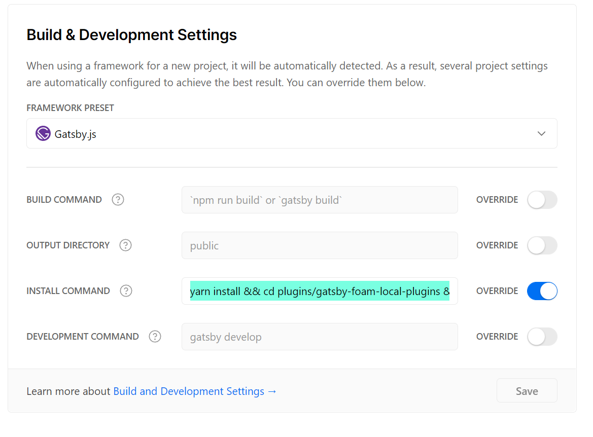
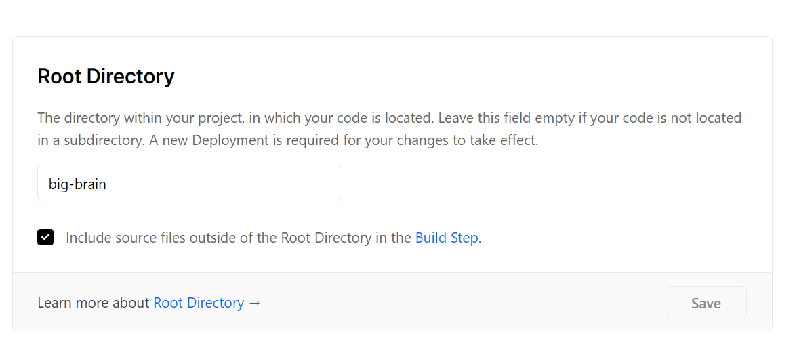

# Deployment, Infrastructure & Setup

Based on [[Website Architecture]], there are few things I want in terms of getting this running:

- Minimal custom configuration as possible, especially in terms of resources setup
- Minimal works and replicable
- Highly automated and data agnostic

## Infrastructure

- The majority of the infrastructure is on AWS with some exception (i.e: documentation pages is hosted on Vercel).
  - Allows future health monitoring and cost to be centralized
  - Structured, Well-maintained --> Allows focus on business logic and less on server configuration
- In the future, there will also be integration with "on-premise" servers, IoT devices and other cloud provider (on a case-by-case basis)

## Tools used

- [Amplify](https://aws.amazon.com/amplify/): Used to orchestrate all AWS resources. It has support for CreateReactApp, couple of AWS official resource support and ability to write custom CloudFormation if needed
  - This requires AWS account
- [Vercel](https://vercel.app): Seamless and serverless static pages deployment. Great for GatsbyJS deployment with GitHub document/CMS store
- [GitHub Actions](https://github.com/features/actions): for automated scripts when new versions are released/new commit pushed
- [standard-version](https://github.com/conventional-changelog/standard-version): versioning and changelogs generation based on [conventional commits](https://www.conventionalcommits.org/en/v1.0.0/)

## Setup

### Initialization

#### 1. Clone/Fork the project from GitHub

It is recommended to fork this from your repo as a lot of deployments are github repo based

```bash
$ git clone git@github.com:<your-github-handle>/big-boi.git
$ cd big-boi/
```

#### 2. Setup Amplify

Amplify will authorize with your AWS account for deployment

```bash
# need to run `yarn global add @aws-amplify/cli`
$ amplify init
# ... follow instruction ...
```

#### 3. Deploy AWS infrastructure

```bash
$ amplify publish
# choose Yes
```

#### 4. Capture infrastructure output and update GitHub Secrets

Below are the secrets need to be updated

```bash
AWS_ACCESS_KEY_ID
AWS_SECRET_ACCESS_KEY
DISTRIBUTION            # Refer to cloudfront distribution ID
```

#### 5. Hook up Vercel deployment as a new project




Install Command is `yarn install && cd plugins/gatsby-foam-local-plugins && yarn install`

### Continuous Development

When new features/configurations are updated

#### 1. Commit with conventional commits

#### 2. Release a new version

```bash
$ yarn release
$ git push --follow-tags origin develop
```
