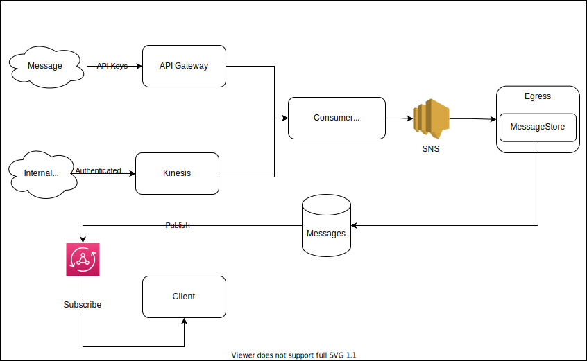

# Message Communication

As shown on [[Website Architecture]], a core feature of this web app the ability to process data from different sources and distribute them to appropriate egress services

The graph shows the current state of the backend communication platform



Here's the example of intake message schema

```json
{
  "id": "6293d2b3-5fde-4bf0-8b69-14734283f7bd",
  "sourceID": "shardId-000000000000:49620770030960603994186530106341665232583331965449535490",
  "source": "aws:kinesis:record",
  "eventType": "Personal.BlogPost.Update",
  "content": {},
  "metadata": {
    "timestamp": 112904812049,
    "sourceURI": "arn:aws:kinesis:us-east-1:142037127835:stream/bigboidefaultkinesis-dev",
    "visibility": "public",
    "sourceMessage": {},
    "additionalData": {},
    "isValid": false
  },
  "publishInfo": {
    "icon": {
      "type": "Icon",
      "value": "info"
    },
    "subject": "Dat",
    "subjectLink": "https://www.datbdo.com",
    "action": "just updated",
    "target": "his blog post",
    "targetLink": "https://www.test.com/",
    "message": "Dat just updated his blog post"
  }
}
```

## Critical Points

These are important details that should be addressed. Some of these might not be most suboptimal (or I was not the most satisfy with the implementation)
The goal here is to keep notes of it so we can raise awareness

### Flexibility of ingress source

#### Current State

- There is a Kinesis stream ingress (authenticated via [[User Pools Authentication]]), which allow free form data comming in (although they still get formatted into message schema afterwards).
- The other ingress source is Rest API via API Gateway. This only required an API Key to authenticate to open for wide variety of integration
  - For Webhook actions, it will be proxied through [[Webhook Proxy]]

#### Open Questions

- Is Rest API with just API Key enough security? Would there be trade off if there are more security measure there?
- How open should incoming data validation be?

### [[Message Categorizer]]

### Message visibility

#### Current State

- Each message comes with a visibility tags (`public` or `private`) but it is currently not enforced
- Currently, every message is being stored within

#### Open Questions

- Should we store private messages?

### Fan-in/Fan-out

#### Current State

- Currently SNS handling fan-in and fan-out. This force subscribing lambdas to directly declare with SNS?

#### Open Questions

- Do we need to proxy SNS? Should lambda be agnostic?
